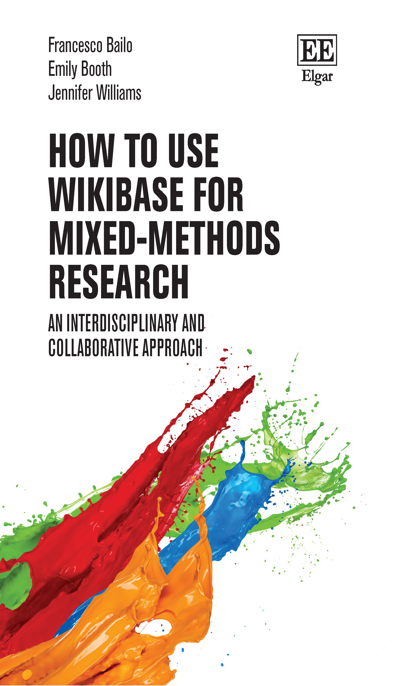
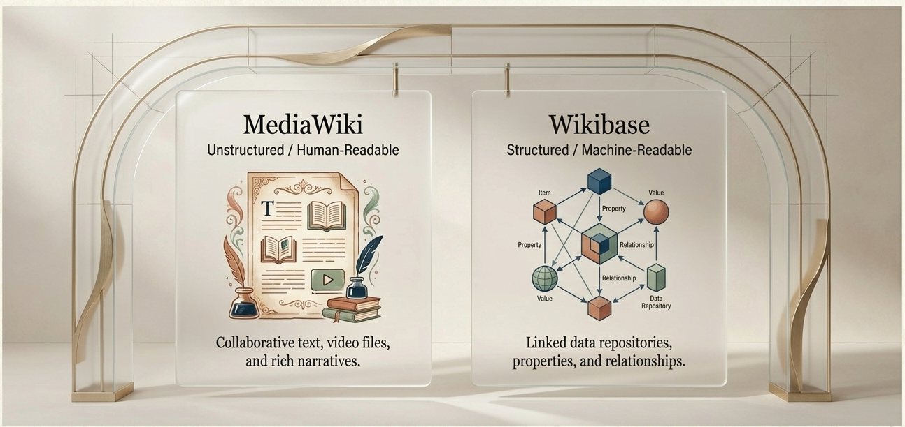
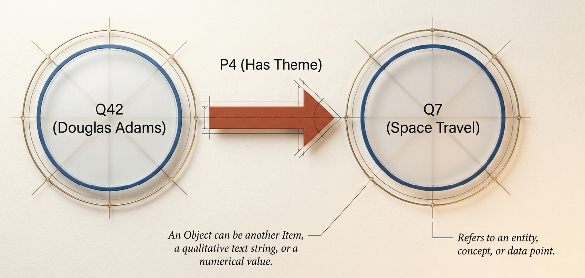
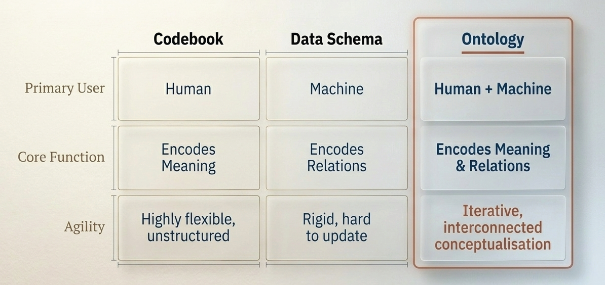
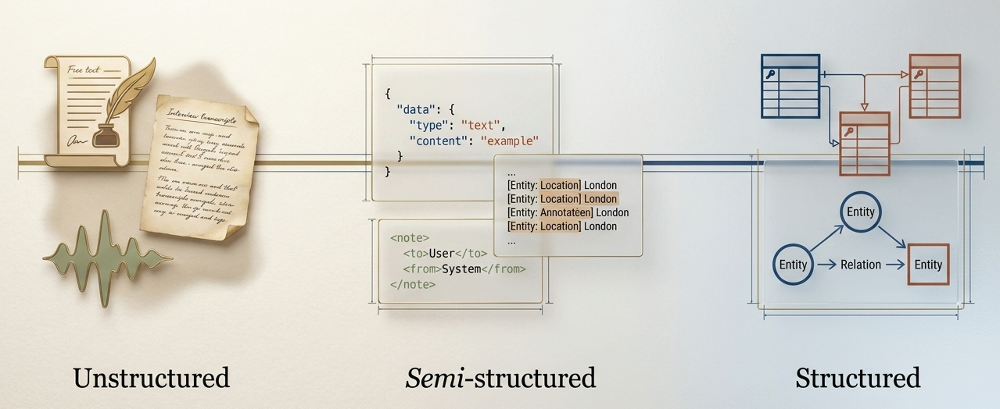
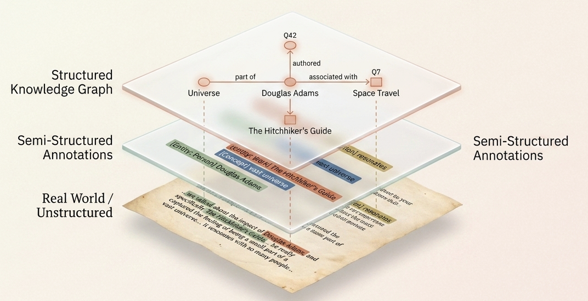
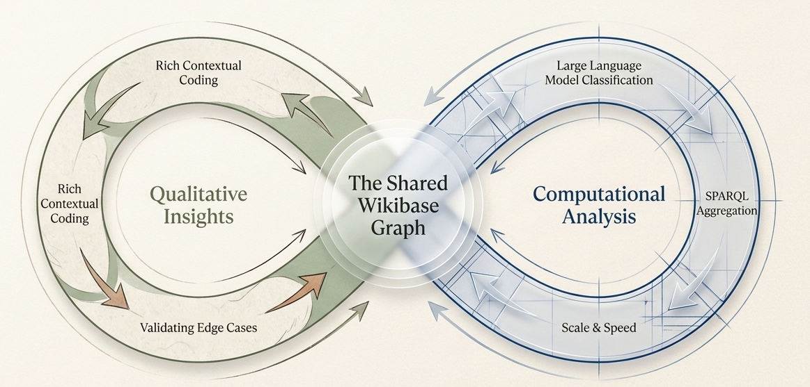

## {background-image="assets/slide-cover.png" background-size="cover" background-position="center"}

::: {.cover-title}
Building Interdisciplinary Knowledge Graphs
:::

## About me {.smaller}

:::: {.columns}

::: {.column width="35%"}
{fig-alt="Francesco Bailo" width="75%"}
:::

::: {.column width="65%"}
**Francesco Bailo**

Senior Lecturer in Data Analytics in the Social Sciences at the **University of Sydney**, where I am also deputy director of the [Centre for AI, Trust and Governance](https://www.sydney.edu.au/arts/our-research/centres-institutes-and-groups/centre-for-ai-trust-and-governance.html).

* Research on social media, political communication, and computational social science.
* Co-author of *How to use Wikibase for mixed-methods research* (Edward Elgar, 2026).

[francesco.bailo@sydney.edu.au](mailto:francesco.bailo@sydney.edu.au)
:::

::::

## About this book {.smaller}

:::: {.columns}

::: {.column width="40%"}
{fig-alt="Cover of How to use Wikibase for Mixed-Methods Research" height="460"}
:::

::: {.column width="60%"}
**How to use Wikibase for mixed-methods research: An interdisciplinary and collaborative approach**

Francesco Bailo, Emily Booth & Jennifer Williams (2026). Edward Elgar Publishing.

* A practical, end-to-end guide: from installing Wikibase to designing ontologies, importing data, and querying a live knowledge graph.
* Built around real case studies of online misinformation and political communication.
* Written for *every* team member — from qualitative coders to computational specialists.
* Today's session distils the book into a hands-on workshop; chapter references appear as bracketed numbers throughout.
:::

::::

# PART 1: The Interdisciplinary "Table" (0-15 min)

## The "Day One" Challenge
* Research starts with a "blank slate" and high excitement.
* Common pain points:
    * Team members move institutions — and their data and tacit knowledge often move with them.
    * Software unfamiliarity across disciplines: a tool obvious to one member is a wall to another.
    * Inconsistent data organisation by research assistants, with no shared convention.
* The cost is paid later: data nobody can find, reuse, or trust.

## The Chaos of Data Management
* Months later, you find data that is inaccessible to half the team.
* The "lack of clarity" in organisation leads to data that is never structured.
* Files scatter across laptops, drives, and email threads, each with its own private logic.
* Need: a single system that bridges location, technical skill, and discipline gaps.

## Defining Interdisciplinary Research
* Simplest terms: research by scholars from different disciplines.
* Integrates different perspectives, values, and cultural frameworks.
* Creates frameworks that occupy the intersections of boundaries — not just the sum of separate fields.
* The goal is a genuinely shared object of study, not parallel mini-projects.

## The "Comfort Zone" Problem
* Interdisciplinary research is "uncomfortable" by design.
* Requires stepping beyond comfortable disciplinary traditions and vocabularies.
* Necessary because some problems are too multifaceted for one "toolbox".
* The discomfort is productive: it forces assumptions to be made explicit.

## Research stalls when disciplines speak incompatible languages

{.wide-figure}

Mixed-methdos research often fails because data is siloed in incompatible formats and disciplinary jargon, resulting in parallel play rather than true integration

## Integration vs. Multidisciplinary Work {.smaller}
* **Multidisciplinary:** researchers work in separate rooms, contributing only when finished.
* **Interdisciplinary:** the team works from day one "around the same table".

{.wide-figure fig-alt="True integration requires working around the same digital table from day one"}

* Integration of assumptions, methodologies, and design is the key difference.
* Wikibase is our metaphor — and mechanism — for that shared table.

## Wikibase as the "Digital Table"
* Wikibase provides the shared digital workspace where the team actually meets.
* Allows all team members to collaborate **simultaneously**, not in sequence.
* Breaks down silos between qualitative and quantitative streams.
* Everyone reads and writes to the *same* evolving knowledge base, with full history.

{.wide-figure fig-alt="True integration requires working around the same digital table from day one"}

## Example: The Climate Change Silo
* Climatologists, economists, and political scientists often work autonomously.
* Output is a "combined report" rather than an "integrated model".
* Models are rarely modified based on cross-disciplinary insights.
* Each field optimises its own piece; the seams between them go unexamined.

## The Integrated Climate Model
* In an interdisciplinary team, contributions are **interdependent**.
* Political stability indicators might modify climate models.
* Climate tipping points inform economic feasibility studies.
* Insights flow *both* ways, so each discipline's output becomes another's input.

## Example: Communication Technology
* Social scientists (qualitative) and computer scientists (computational) on one problem.
* Shared frameworks accommodate both nuanced hate-speech observations and structured algorithmic data.
* Manual coding becomes training data; algorithmic results are fed back for validation.
* The loop only works if both sides write to a common, legible structure.

## Transparency and Accessibility
* Interdisciplinarity requires a workspace accessible to all, regardless of technical background.
* Information buried in technical jargon or complex data packages (e.g., GRIB, netCDF) is a barrier.
* Wikibase provides a web-based interface everyone can use from a browser.
* Lowering the access barrier is itself a methodological choice, not just convenience.

## Developing a Common Language
* Freedom to move independently without requiring "cross-disciplinary interpreters".
* A common language emerges from layering structured and unstructured data side by side.
* Allows researchers to contribute without sacrificing the complexity of the data.
* Terms are defined once, in the open, and reused — reducing quiet misunderstandings.

## The Integrated Strategy
* Mixed-methods defines the **data integration strategy**, not just a mix of techniques.
* It specifies how evidence is collected, structured, and analysed *together*.
* Moves beyond "piling up findings" to a single, coherent problem-solving approach.
* The "point of interface" — where qualitative and quantitative meet — is designed, not improvised.

## Three Preliminary Questions
1. Can the problem be addressed with only one data type?
2. Can you practically and ethically collect only one type?
3. Does the team have the capability to handle multiple types?

If "yes" to the first, mixed-methods may be unnecessary overhead — answer these before committing.

## Ethical Considerations
* Higher research benefits (e.g., reducing conflict) can justify higher participant risk.
* Failing to use collected data creates risk without benefit — an ethical violation.
* Avoid "data surfacing": collecting everything simply because you can.
* Good data management is therefore an *ethical* practice, not only a technical one.

# PART 2: Core Concepts & Software (15-30 min)

## What is Wikibase?
* Not standalone software, but an extension of **MediaWiki**.
* MediaWiki provides the website/wiki functionality the project lives in.
* Wikibase adds the **structured data repository** capabilities on top.
* It is free, open-source, and maintained by Wikimedia Deutschland — the same family as Wikipedia.

## MediaWiki vs. Wikibase: Functions
* **MediaWiki:** collaborative web pages, wikitext, images, videos.
* **Wikibase:** "Special Pages" representing well-defined Items (Q) and Properties (P).
* Together, they handle both unstructured narratives and structured facts in one place.
* You never have to choose between "a wiki" and "a database" — you get both, linked.

{.wide-figure}

## The Wikidata Inspiration
* Wikidata is the world's largest Wikibase instance.
* Designed to centralise facts from Wikipedia into a knowledge graph.
* Aimed at making knowledge "machine-readable" and "discoverable".
* Your project reuses the same battle-tested model at a much smaller, private scale.

## The Data Model: Entities
* **Items (Q numbers):** distinct concepts, objects, or things (e.g., Q42).
* **Properties (P numbers):** attributes or relationships (e.g., P31 "instance of").
* These identifiers are **persistent**, even if their human-readable labels change.
* Stable IDs mean a renamed concept never breaks the links pointing at it.

## The Triple Statement
* The fundamental unit of data linkage.
* Structure: **Item → Property → Object** (subject–predicate–object).
* The Object can be another Item, text, a number, or a date.
* Every fact in the graph reduces to triples — simple parts, rich networks.

{.wide-figure}

## Statements and Groups
* A "Statement" is the combination of a property and a value.
* A "Statement Group" is multiple values for the same property (e.g., an MP holding several roles).
* This reflects real-world complexity where relationships aren't 1-to-1.
* You don't flatten messy reality into a single cell — the model carries the nuance.

## Qualifiers and References
* **Qualifiers:** add context to a statement (e.g., a "start date" for a role).
* **References:** support a statement by linking to its source.
* Essential for scientific integrity and tracking the provenance of data.
* Together they answer not just *what* is claimed, but *when, in what scope, and on what evidence*.

## Essential Data Types
* **String:** short textual descriptions or researcher notes.
* **Quantity:** numerical values for metrics (e.g., "likes").
* **Time:** dates (Point in time vs. EDTF).
* **URL:** external links (e.g., parliamentary profiles).
* Choosing the right datatype up front is what later makes the data queryable.

## Precision in Time (EDTF)
* Traditional "Point in Time" lacks time zones and timestamps.
* **Extended Date/Time Format (EDTF):** includes date, timestamp, and UTC zone.
* Critical for social media research, where timing is relative to the observer.
* It also handles uncertainty — approximate or partial dates — without forcing a false precision.

## External Identifiers & URL Formatters
* Link your items to external databases (e.g., LinkedIn, ORCID).
* URL formatters automate link creation from a stored pattern.
* Example: storing an MP's ID (R36) to generate a clickable parliamentary-profile link.
* Store the ID once; the live hyperlink is built for you everywhere it appears.

# PART 3: Project Design & Ontology (30-50 min)

## Codebook vs. Schema vs. Ontology
* **Codebook:** qualitative; defines variables and coding schemes for humans.
* **Data schema:** technical; defines structure in a formal language for machine storage.
* **Ontology:** a formal, explicit specification of a **shared conceptualisation**.
* The ontology is where the human codebook and the machine schema become one artefact.

## Why an Ontology?
* Encodes both **meaning** (like a codebook) and **relations** (like a schema).
* Facilitates human–machine communication in a single representation.
* Bridges qualitative interpretation with computational processing.
* It becomes the team's living agreement about what exists and how things connect.

## Building an Ontology from Scratch
* Unlike codebooks, ontologies don't require data to exist first.
* You can define the project's "worldview" before the first interview.
* Involve non-technical people in the design so it stays relevant to the research questions.
* Designing it together surfaces disagreements early — while they're still cheap to fix.

## The Starter Ontology
* Begin with a list of essential concepts and data types.
* Identify key themes and metadata (e.g., interview date, URL).
* Map relations using software like **Protégé** or Wikibase itself.
* Start small and concrete; the first version only has to be useful, not complete.

## Visualising the Ontology
* **Indented list:** simple hierarchy, limited to vertical relations.
* **Node-link map:** mind-map style showing 2D relationships.
* Gives the team a "bird's-eye view" of the research domain.
* A shared picture makes gaps and overlaps visible to everyone at once.

 (Image credit: Vindula Jayawardana)

## Iterative Refinement
* Ontologies must grow as the project progresses.
* Initial ontologies are almost always incomplete.
* Schedule review meetings (e.g., every 3 months) to adapt to new findings.
* Treat the ontology like code: versioned, discussed, and deliberately changed.

## Establishing Team Requirements
* Discuss individual researcher needs early.
* Qualitative: small, deep samples (e.g., 30 interviews).
* Quantitative: large volumes, plus "negative examples" for models (e.g., "not fake news").
* One shared structure has to serve both — design it knowing both demands up front.

## Ontologies as Codebooks
* Wikibase can hold a "second level of coding" over existing items.
* Apply new relations (e.g., "has theme") without disturbing the originals.
* Preserves the original understanding while adding analytical layers.
* Re-coding becomes additive, so earlier interpretations are never overwritten.

## Example: Tangible Objects
* Item: "Book" → instance of: "Paper Object".
* Properties: author, publication year, number of chapters.
* This maps the "world" of the project consistently.
* Even mundane objects get a stable, queryable description the whole team shares.

## Example: Human Data (Focus Groups)
* Item: "Teacher Focus Group 1".
* Properties: date, location, school, recording length, participants.
* Links to: "Topics Discussed" (e.g., workload, curriculum).
* Sensitive human data stays structured *and* contextual — ready for ethics-aware analysis.

# PART 4: Data Layering (50-55 min)

## Data exists on a continuum of structure, not a rigid qual-quant binary.

{.wide-figure}

## Objective of computational sciences should be to preserve human context whilst computationally layering structure.

{.wide-figure}

## The Layering Metaphor
* Research data is rarely "one type".
* Data progresses top to bottom, becoming more structured at each layer.
* Vertical links connect items to properties; horizontal links enable comparison.
* You add structure *over* the raw data rather than replacing it.

{.wide-figure}

## Layer 1: Unstructured Data
* Real-world information: text, audio, images.
* Stored as regular MediaWiki pages for human readability.
* Example: a full interview transcript, kept intact.
* Nothing is lost or reduced — the rich source remains the foundation.

## Layer 2: Semistructured Data
* Standardised headers or annotations added to unstructured text.
* Example: standard metadata in a transcript (date, interviewer, place).
* JSON or RDF formats are used for export at this layer.
* A light scaffold makes the unstructured material findable and comparable.

## Layer 3: Structured Data
* Items related to other items or values through properties.
* Fits a table format; machine-readable and searchable.
* Enables knowledge-graph construction and SPARQL querying.
* This is the layer that powers counting, mapping, and modelling.

## Why Layer?
* Prevents "transforming" original data into numbers too early.
* Keeps flexibility to adapt to different methodologies.
* Qualitative researchers keep the "rich text"; quantitative analysts get "data points".
* The same record serves both audiences without either losing what they need.

# PART 5: Hands-on — Build a Live Knowledge Graph (55-85 min)

## The hands-on workflow
We now build the Chapter 6 example end to end: a mixed-methods study of how MPs communicate across parliamentary and social-media platforms.

Five steps, theory meeting practice at each:

1. **Create** your Wikibase instance.
2. **Define** the ontology — create the properties.
3. **Import** the dataset in bulk.
4. **Query** the graph with SPARQL.
5. **Advance** — quality, scaling, and integrity.

> All materials are in the repository **[github.com/fraba/wikibase-mixed-methods-research](https://github.com/fraba/wikibase-mixed-methods-research)** — see `wikibase-cloud-setup.md` and the `wikibase-import-data/` folder.

## Step 1 — Three ways to run Wikibase
* **Linux web server (production):** install the containerised stack on a server with a public IP — full control, but needs sysadmin skills and institutional IT (Chapter 3).
* **Docker on your laptop (local):** run the official `wikibase-release-pipeline` images locally — great for testing, but not publicly reachable.
* **Wikibase.cloud (hosted):** a free, browser-based instance from Wikimedia Deutschland — no installation. **← we use this today.**

## Step 1 — Why Wikibase.cloud for the workshop
* Zero setup: the wiki, the SPARQL service, and QuickStatements are all provisioned for you.
* Same software family as Wikidata, so the skills transfer to a self-hosted instance later.
* Trade-off: instances are **publicly visible** and in beta — fine for practice, not for sensitive data.
* Full walkthrough: **`wikibase-cloud-setup.md`** in this repo.

## Step 1 — Create your instance (hands-on)
1. Sign up at **wikibase.cloud** and verify your email.
2. **Create a Wikibase** — choose a name (becomes your URL), an admin username, and a purpose.
3. Wait for provisioning, then set the temporary password sent to your inbox.
4. Note your three URLs:
    * wiki — `https://<you>.wikibase.cloud`
    * query — `…/query`
    * QuickStatements — `…/tools/quickstatements`

## Step 2 — From ontology to properties
* Recall: **properties (P)** are the relationships and attributes of our ontology, each with a fixed **datatype**.
* The Chapter 6 ontology needs **9 properties** (P1–P9): `instance of`, `subclass of`, `has`, `has transcript`, `has media file`, `has message`, `publication date`, `has sentiment`, `mentions`.
* Datatypes matter — Item, URL, Media file, String, Point in time, Quantity — chosen now, they make the data queryable later.

## Step 2 — Create the properties (hands-on)
* Go to **Special:NewProperty** and create them **in order P1 → P9**.
* **Why order matters:** Wikibase assigns IDs incrementally, and the import batch refers to fixed IDs — so P1–P9 must line up.
* Import into a **fresh** instance so the very first property becomes P1.
* Reference: **`wikibase-import-data/import-guide.md`** (Step 1) and `properties.csv`.

## Step 3 — The dataset to import
* 7 **classes** (Q1–Q7): MP, Speech, Person, Social media posting, Interview, Organisation, Theme — with MP a *subclass of* Person.
* 30 **individuals** (Q8–Q37): MPs, speeches, posts, interviews, persons, organisations, themes.
* 77 **statements** linking them — the structured layer laid over the unstructured sources.

## Step 3 — Bulk import with QuickStatements (hands-on)
* Open QuickStatements (`…/tools/quickstatements`) and authorise it against your wiki.
* Paste the batch from **`quickstatements_import.txt`** and run it in three phases:
    * Phase 1 — the 7 class items.
    * Phase 2 — the 30 individuals with their `instance of`.
    * Phase 3 — all 77 statements (links, dates, sentiment, transcripts, media).
* **Spot-check:** open *Margaret Hale (Q8)* → she `has` two speeches, a post, and an interview. Use **"What links here"** to reverse-navigate.

## Step 3 — Or create items by hand
* **Special:NewItem** — give a Label, Description, and Alias; a Q number is minted automatically.
* Add a **statement**: pick a Property, enter a value, and optionally a qualifier and a reference.
* Duplicates happen in large teams — **Special:MergeItems** moves all statements onto a single Q.

## Step 4 — Querying: the knowledge graph
* You now have a live **knowledge graph**: nodes = Items, edges = Properties.
* It existed implicitly as you imported — SPARQL simply lets you read its patterns.
* Open the **Query Service** at `…/query`.

## Step 4 — SPARQL basics
* `SELECT` what you want; `WHERE` the graph pattern to match.
* Prefixes `wd:` / `wdt:` abbreviate your instance's URLs; variables start with `?`.
* Triple matching: `?mp wdt:P1 wd:Q1` — "?mp is an instance of MP".
* Chaining triples walks the graph: MP → speech → theme.

## Step 4 — Run the queries (hands-on)
Run these from `import-guide.md`, switching result **views** as you go:

* **All MPs and their speeches** — the basic join.
* **Posts per theme** — `GROUP BY` to monitor coding coverage.
* **Average sentiment per MP** — structured and processed data together.
* **Timeline of speeches and posts** — try the Timeline / Scatter view.

## Step 5 — Monitoring data quality
* Use `MINUS` to find **orphans** — items with no `instance of`.
* After a clean import this returns nothing — a quick integrity check.
* Turn recurring checks into saved queries, not manual audits.

## Step 5 — Automation & scaling
* Manual coding becomes **training data** — in the book's case, a RoBERTa model.
* The model classified 1.6M posts; results were written back via the **API**.
* "Human-in-the-loop" refined it over 7 iterations, with Wikibase as the meeting point.

## Step 5 — AI & Retrieval-Augmented Generation
* Combine the structured graph with an LLM.
* Ask in natural language: "What are the main themes for Labour MPs?"
* Answers stay **traceable** to real statements in your graph.

## Case study: Melanesian social media
* Two coding axes at once — themes (Phase 1) and narrative constructions (Phase 2).
* Narrative constructions tracked actors, tactics, and veracity.
* The same items carried both frameworks without collapsing either.

# PART 6: Integrity & Wrap-up (85-90 min)

## Integrity built in
* **Version control:** every change records who, when, and what — easy to revert.
* **Talk pages:** document coding decisions right next to the data they govern.
* **Watch lists:** get notified when new data enters your area of expertise.

## Open science
* Export the graph as **RDF, JSON, or CSV** for public repositories.
* Link to **OSF or GitHub** to meet funder mandates.
* Explicit structure means others can **reuse** your data, not just read it.

## Conclusion
* Wikibase is more than a database; it's an interdisciplinary **workspace**.
* It bridges deep qualitative text and broad quantitative metrics.
* You built it today: instance → ontology → import → query → analyse.
* The shared "table" is the method as much as the tool.

Thank you — questions? **[francesco.bailo@sydney.edu.au](mailto:francesco.bailo@sydney.edu.au)**